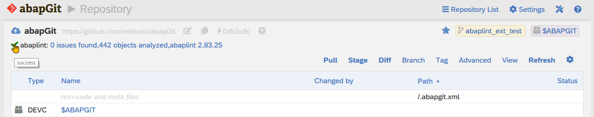
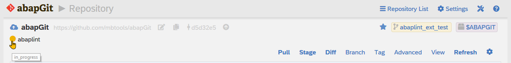
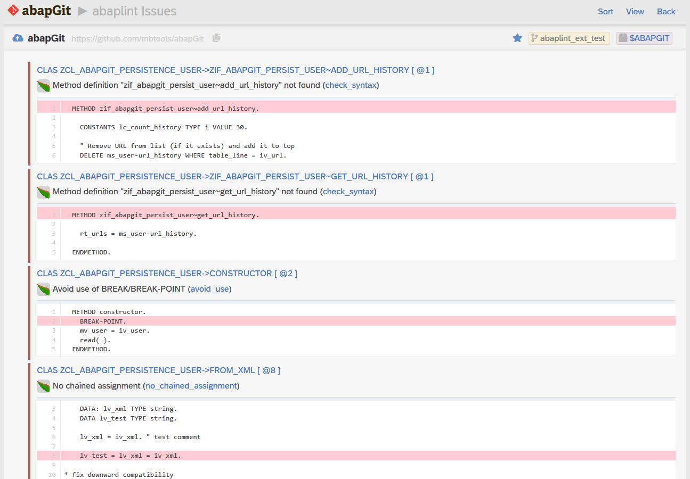
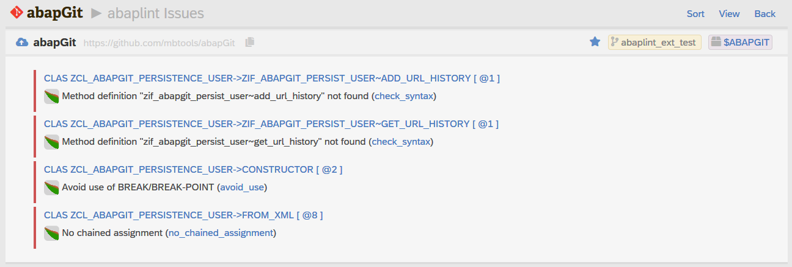

[](LICENSE)
[](https://api.reuse.software/info/github.com/Marc-Bernard-Tools/ABAP-Lint-Ext-for-abapGit)
[](https://clearlydefined.io/definitions/git/github/marc-bernard-tools/abap-lint-ext-for-abapgit/74a702eadd6ebe0a136575e56c65177d83443fa5)
[](CODE_OF_CONDUCT.md)

# abaplint Extension for abapGit

View [abaplint](https://abaplint.org/) results and detailed findings directly in [abapGit](https://github.com/abapGit/abapGit). 

Made by [Marc Bernard Tools](https://marcbernardtools.com/) giving back to the [SAP Community](https://community.sap.com/)

NO WARRANTIES, [MIT License](LICENSE)

## The Problem

After committing changes from abapGit to your repository and running abaplint there, you have to switch to GitHub or another tool to view the abaplint results. If the abaplint check fails, the detailed findings are hard to process since they don't link back to your SAP system where you want to fix the issues.


Note: VSCode with [abaplint extension](https://marketplace.visualstudio.com/items?itemName=larshp.vscode-abaplint) is an exception showing lint results within your ABAP code. But then you are not using abapGit in the first place.

## The Solution

This repository provides an extension for abapGit integrating the abaplint results (as [user exits](https://docs.abapgit.org/ref-exits.html)). A summary of the results is displayed in the abapGit repository view and details are shown on a separate page with a code preview and an option to jump directly to the code in question. 

### Repository View

Under the name of the repository, the status and summary of the last abaplint check will be displayed. 






You can click on the status icon to open the corresponding page on GitHub. If you click on the result summary, the detailed issues will be shown.

### Issue View

The issues are listed similarly to syntax and ATC checks in abapGit. For each finding, the view shows the object type, name, and line number. Below, it prints the abaplint message. A link on the error code opens the corresponding definition on [rules.abaplint.org](https://rules.abaplint.org/). 



Optionally, you can sort the results by object, location, or error code. You can also hide the source code preview.



## Installation

### Repository

You can install the repository using [abapGit](https://github.com/abapGit/abapGit) creating a new online repository for https://github.com/Marc-Bernard-Tools/ABAP-Lint-Ext-for-abapGit. We recommend to use package `$ABAPLINT-EXT`.

### User Exits

Implement abapGit [user exits](https://docs.abapgit.org/ref-exits.html) [`wall_message_repo`](https://docs.abapgit.org/ref-exits.html#wall_message_repo) and [`on_event`](https://docs.abapgit.org/ref-exits.html#on_event) as follows:

```abap
  METHOD zif_abapgit_exit~wall_message_repo.

    zcl_abaplint_abapgit_ext_exit=>get_instance( )->wall_message_repo(
      is_repo_meta = is_repo_meta
      ii_html      = ii_html ).

  ENDMETHOD.
```

```abap
  METHOD zif_abapgit_exit~on_event.

    rs_handled = zcl_abaplint_abapgit_ext_exit=>get_instance( )->on_event( ii_event ).

  ENDMETHOD.
```

### SSL and Certificates

The abaplint status is retrieved via `https://api.github.com/`. Therefore, a proper SSL configuration and certificates for `api.github.com` are required. See [SSL setup](https://docs.abapgit.org/guide-ssl-setup.html) for details.

## Contributions

All contributions are welcome! Just fork this repo and create a pull request. 

## About

<p>Made with :heart: in Canada</p>
<p>Copyright © 2022 <a href="https://marcbernardtools.com/">Marc Bernard Tools</a></p>
<p>Follow <a href="https://twitter.com/marcfbe">@marcfbe</a> on Twitter</p>
<p><a href="https://marcbernardtools.com/"></a></p>
